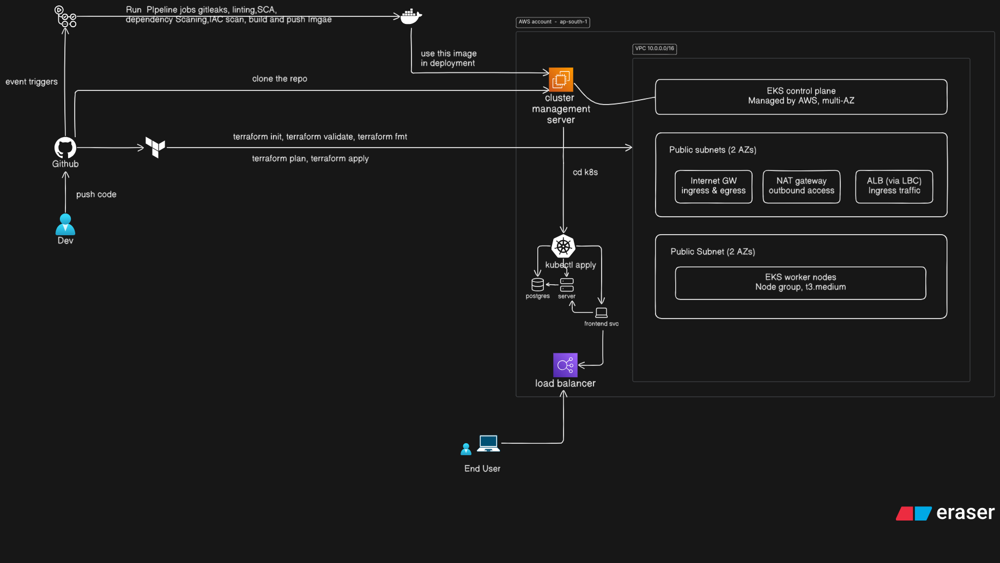

# Zylo — Architecture

## Overview

Zylo runs on AWS EKS, deployed via a GitOps-style pipeline: code is pushed to GitHub, validated and built through CI, then applied to the cluster with `kubectl`.

## Flow

1. **Dev** pushes code to **GitHub**.
2. GitHub triggers two paths:
   - **Terraform**: runs `terraform init/validate/fmt` on every push, and `terraform plan/apply` to provision the **cluster management server** and AWS infra.
   - **CI/CD pipeline**: runs Gitleaks, linting, SCA, dependency scanning, and IaC scanning, then builds and pushes a **Docker** image.
3. The cluster management server pulls the built image and `cd`s into the `k8s` manifests directory.
4. `kubectl apply` deploys the manifests to the cluster: **Postgres**, **server**, and **frontend svc**.
5. Traffic reaches the app through a **load balancer**, used by the **end user**.

## AWS Infrastructure (ap-south-1)

- **VPC** `10.0.0.0/16`
- **EKS control plane** — managed by AWS, multi-AZ
- **Public subnets (2 AZs)** — Internet Gateway, NAT Gateway, ALB (via Load Balancer Controller)
- **Public subnet (2 AZs)** — EKS worker nodes (`t3.medium` node group)

## Security & Quality Gates (CI)

- Secret scanning — Gitleaks
- Linting
- Software Composition Analysis (SCA)
- Dependency scanning
- IaC scanning
- Image build & push, only after all gates pass

## Components

| Component                 | Role                                                 |
| ------------------------- | ---------------------------------------------------- |
| GitHub                    | Source control, triggers CI/CD                       |
| Terraform                 | Provisions AWS infra (VPC, EKS, subnets, node group) |
| Docker                    | Builds and stores the application image              |
| Cluster management server | Pulls image, applies k8s manifests                   |
| EKS (worker nodes)        | Runs Postgres, server, and frontend service          |
| Load Balancer             | Routes end-user traffic into the cluster             |
